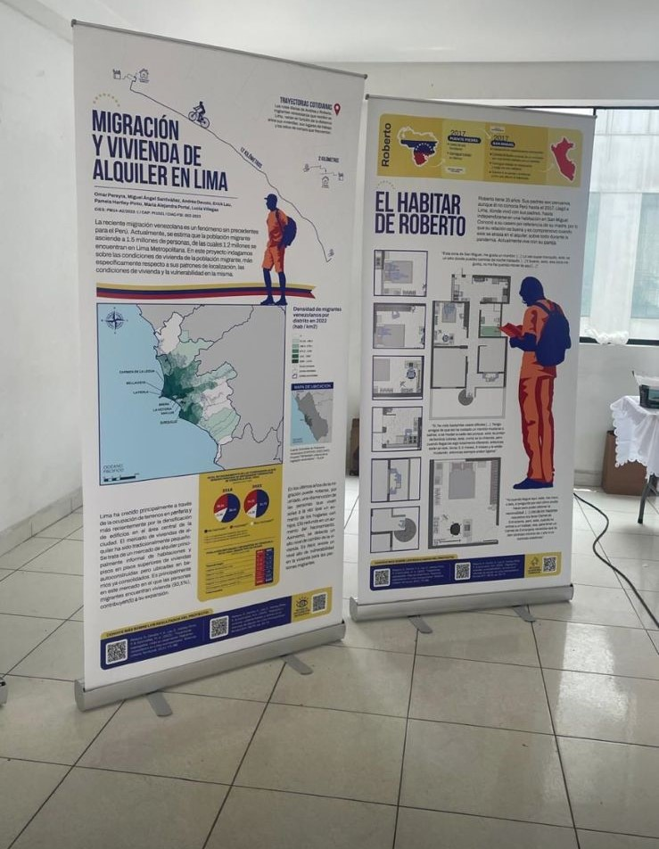
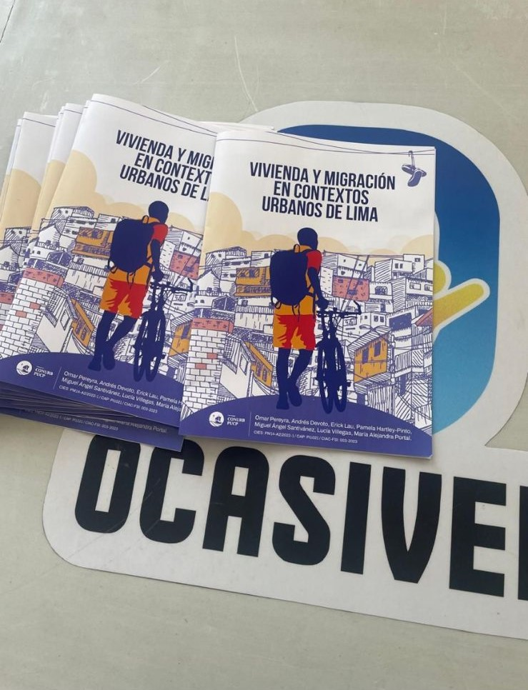

# Portafolio 
Hola, soy Lucía. Me formé como socióloga en la PUCP y me gusta observar cómo las personas viven, deciden y habitan lo cotidiano. He trabajado en investigación cualitativa aplicada y he comenzado a explorar caminos en diseño de servicios e innovación, siempre desde una mirada crítica y situada. Creo en la escucha activa, en las preguntas bien hechas y en traducir hallazgos en ideas accionables. Este enfoque me llevó a proponer soluciones que combinan análisis urbano, vivienda, migración y género con metodologías participativas. Una de ellas fue “Mi casa, mi negocio”, propuesta ganadora del reto Mezcladora Home Challenge, 2025. También desarrollé un policy brief con recomendaciones para el programa Techo Propio, el cual presenté en el Instituto Metropolitano de Planificación. Más abajo puedes ver algunos de los proyectos que marcan el rumbo que estoy construyendo. Estoy en formación, y con muchas ganas de seguir aprendiendo.  
- 📩 [lucia.villegas@pucp.edu.pe](mailto:lucia.villegas@pucp.edu.pe)  
- 🔗 [LinkedIn](http://www.linkedin.com/in/luciavillegasguerrero)

## 🏠 Mi casa, mi negocio
**Reto:** Mezcladora Home Challenge – UTEC Ventures  
**Rol:** Coautora de la propuesta interdisciplinaria  
**Año:** 2025  

### Resumen del proyecto
 “Mi casa, mi negocio” fue una propuesta ganadora del reto Mezcladora Home Challenge, centrado en imaginar soluciones habitacionales innovadoras para familias de sectores C y D. Diseñamos una solución de vivienda mixta que permite a las familias generar ingresos desde el hogar y acceder al sistema financiero de forma progresiva.
Combinamos diseño arquitectónico funcional, estrategias de inclusión financiera y un enfoque participativo centrado en las necesidades reales de las familias. El reto fue una oportunidad para integrar metodologías de diseño de servicios con herramientas de análisis urbano y sensibilidad social.

### Lo que hice
- Co-diseñé la propuesta conceptual, enfocada en las necesidades de familias con ingresos informales.
- Aporté al análisis de usuario, construcción del caso ejemplo y estructuración narrativa del entregable.
- Participé en la elaboración de un pitch claro, visual y orientado a viabilidad técnica y social.

### Lo que aprendí
Este proyecto fue mi primer acercamiento al diseño de servicios y a la lógica de innovación aplicada. Aprendí a partir del problema y no de la solución, a trabajar con restricciones reales, y a traducir hallazgos sociales en ideas estructuradas, viables y comunicables. Descubrí cómo colaborar entre disciplinas y construir propuestas con impacto social desde lo concreto.

## 🧱 Vivienda digna en Lima Metropolitana
**Evento:** I Diálogo Urbano Metropolitano – Instituto Metropolitano de Planificación  
**Rol:** Autora y expositora del policy brief  
**Año:** 2025  
### Resumen del proyecto
Esta propuesta parte de un insight claro: las mujeres jefas de hogar son clave para activar procesos de mejora habitacional, pero los programas actuales no están diseñados para responder a su realidad. A partir de esa premisa, desarrollé un policy brief con foco en usuarios reales, brechas estructurales y rediseño de procesos.  
La propuesta integra tres frentes: acceso al financiamiento, asistencia técnica accesible y asignación equitativa de recursos. Todo bajo una lógica de progresividad, flexibilidad y escalabilidad urbana. El enfoque fue generar una estrategia viable y centrada en el usuario, que articule diseño, datos y política pública.
### Lo que hice
- Sistematización de datos secundarios y benchmarking de políticas habitacionales con enfoque comparativo.
- Identificación de puntos críticos del programa Techo Propio desde la experiencia usuaria.
- Rediseño de componentes clave del programa, priorizando la autonomía económica de mujeres, el acompañamiento técnico y el acceso a soluciones progresivas y adaptadas.
- Diseño visual y narrativo del brief para toma de decisiones estratégicas, y presentación del pitch en evento público.

### Lo que aprendí
Profundicé en el valor de aplicar una lógica centrada en el usuario al diseño de políticas públicas. Aprendí a comunicar evidencia de forma clara para públicos no técnicos y a estructurar propuestas estratégicas con impacto real. Este proyecto fortaleció mi capacidad de análisis estructural sin perder de vista la experiencia cotidiana de las personas.

## 🏙️ Geografías del alquiler informal migrante en Lima
**Proyecto académico con proyección pública**  
**Rol:** Asistente de investigación cualitativa  
**Año:** 2024–2025  
### Resumen del proyecto
Este estudio explora cómo las personas migrantes —principalmente venezolanas— acceden y habitan el mercado informal de alquiler en Lima Metropolitana. Desde una mirada etnográfica y visual, el proyecto busca mapear patrones de movilidad, condiciones de vivienda, y vínculos entre territorio, exclusión y agencia cotidiana.
El objetivo es generar evidencia situada sobre las trayectorias urbanas de arrendamiento informal y construir una narrativa visual accesible para tomadores de decisiones, organizaciones sociales y las propias comunidades migrantes.

### Lo que hice
- Diseñé y apliqué instrumentos cualitativos centrados en el usuario (entrevistas a profundidad y mapeos del espacio habitado).
- Sistematizé más de 10 entrevistas mediante matrices temáticas, identificando patrones de uso del espacio, estrategias de movilidad y acceso informal a vivienda.
- Apoyé en la conceptualización de productos visuales (paneles expositivos) y en la preparación del libro del proyecto, actualmente en proceso. 
### Lo que aprendí
Este proyecto me permitió observar cómo las personas negocian sus condiciones de vida en contextos adversos y cómo el territorio urbano moldea decisiones. Aprendí a leer el espacio como expresión de desigualdades, pero también como lugar de agencia. Fortalecí mi capacidad para traducir investigación en productos accesibles y culturalmente sensibles.

## “Dios te diría ‘Yo no te hice esclava’”
**Publicación académica en La Colmena (PUCP)**  
**Rol:** Coautora del estudio cualitativo  
**Año:** 2023 
### Resumen del proyecto
Este estudio explora cómo las mujeres congregantes de una iglesia evangélica masiva en Lima construyen sus percepciones sobre el rol de la mujer en la vida pública y privada. Desde entrevistas en profundidad, el trabajo analiza cómo se articulan creencias religiosas, trayectorias personales y discursos institucionales en torno a temas como maternidad, liderazgo, matrimonio y trabajo remunerado.
El proyecto revela tensiones entre valores tradicionales y aspiraciones de autonomía, y muestra cómo las mujeres interpretan su fe de forma activa, selectiva y situada. La publicación se orienta a comprender representaciones culturales que operan en la vida cotidiana y ofrecen pistas clave para el diseño de estrategias sensibles a contextos de fe, género y transformación social.
### Lo que hice
- Co-diseñé la guía de entrevistas y realicé trabajo de campo cualitativo con mujeres de distintos perfiles etarios y ocupacionales.
- Sistematizé los testimonios mediante codificación temática, identificando patrones narrativos y representaciones simbólicas sobre género, familia y espiritualidad.
- Coescribí el artículo, integrando marco teórico y hallazgos de forma narrativa y analítica.
- El artículo fue publicado en la revista académica La Colmena (PUCP, 2023).
### Lo que aprendí
Desarrollé sensibilidad para investigar en contextos donde la fe y la identidad están profundamente entrelazadas. Aprendí a diseñar entrevistas cuidadosas, a escuchar más allá de lo evidente y a interpretar cómo las personas reconstruyen sus roles desde creencias, afectos y trayectorias. Este proyecto fortaleció mi mirada crítica y empática hacia lo simbólico.

