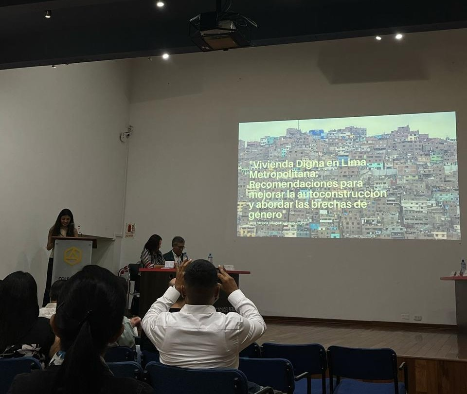
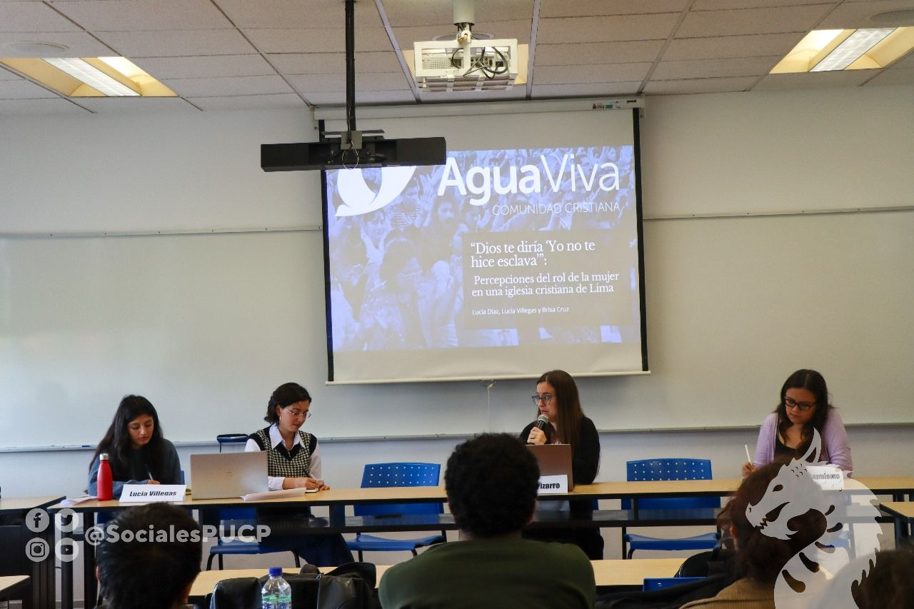

# Portafolio 
Hola, soy Lucía. Soy egresada de socióloga de la PUCP y me gusta observar cómo las personas viven, deciden y habitan lo cotidiano. He trabajado en investigación cualitativa y cuantitativa aplicada y he comenzado a explorar caminos en diseño de servicios e innovación, siempre desde una mirada crítica y situada. Creo en la escucha activa, en las preguntas bien hechas y en traducir hallazgos en ideas accionables. Este enfoque me llevó a proponer soluciones que combinan análisis urbano, vivienda, migración y género con metodologías participativas. Una de ellas fue “Mi casa, mi negocio”, propuesta ganadora del reto La Mezcladora Home Challenge, 2025. También desarrollé un policy brief con recomendaciones para el programa Techo Propio, el cual presenté en el Instituto Metropolitano de Planificación. Más abajo puedes ver algunos de los proyectos que marcan el rumbo que estoy construyendo. Estoy en un proceso continuo de crecimiento, explorando nuevas formas de conectar la investigación con soluciones significativas.
- 📩 [lucia.villegas@pucp.edu.pe](mailto:lucia.villegas@pucp.edu.pe)  
- 🔗 [LinkedIn](http://www.linkedin.com/in/luciavillegasguerrero)

## 🏠 Mi casa, mi negocio
**Reto:** La Mezcladora Home Challenge 2025 – UTEC Ventures  
**Rol:** Coautora de la propuesta interdisciplinaria  
**Año:** 2025  

### Resumen del proyecto
“Mi casa, mi negocio” fue una propuesta ganadora del reto La Mezcladora Home Challenge 2025, centrado en imaginar soluciones innovadoras para mejorar el proceso de autoconstrucción de vivienda en contextos urbanos populares. Junto a mi equipo diseñamos una solución de vivienda mixta que permite a las familias generar ingresos desde el hogar y acceder al sistema financiero de forma progresiva.
Combinamos diseño arquitectónico funcional, estrategias de inclusión financiera y un enfoque participativo centrado en las necesidades reales de las familias. El reto fue una oportunidad para integrar metodologías de diseño de servicios con herramientas de análisis urbano y sensibilidad social.  
[Link a la presentación](/Doc/Entregable_Micasaminegocio.pdf) 

### Lo que hice
- Aporté al diseño de la propuesta habitacional desde una mirada sociológica, incorporando las formas en que las familias habitan la autoconstrucción y sus necesidades reales de uso del espacio.
- Desarrollé el enfoque que articula diseño y acceso al crédito, proponiendo un modelo de financiamiento progresivo adaptado a los ingresos informales y la lógica de negocio de las familias.
- Participé en la elaboración del pitch, estructurando una presentación clara, precisa y accesible para distintos públicos, destacando mi capacidad de comunicar ideas complejas con un lenguaje comprensible y orientado a toma de decisiones.

### Lo que aprendí
Este proyecto fue mi primer acercamiento al diseño de servicios y a la lógica de innovación aplicada. Aprendí a partir del problema y no de la solución, a trabajar con restricciones reales, y a traducir hallazgos sociales en ideas estructuradas, viables y comunicables. Descubrí cómo colaborar entre disciplinas y construir propuestas con impacto social desde lo concreto.

## 🧱 Vivienda digna en Lima Metropolitana
**Evento:** I Diálogo Urbano Metropolitano – Instituto Metropolitano de Planificación  
**Rol:** Autora y expositora del policy brief  
**Año:** 2025  

### Resumen del proyecto
Esta propuesta parte de un insight claro: las mujeres jefas de hogar son clave para activar procesos de mejora habitacional, pero los programas actuales no están diseñados para responder a su realidad. A partir de esa premisa, desarrollé un policy brief con foco en usuarios reales, brechas estructurales y rediseño de procesos.  
La propuesta integra tres frentes: acceso al financiamiento, asistencia técnica accesible y asignación equitativa de recursos. Todo bajo una lógica de progresividad, flexibilidad y escalabilidad urbana. El enfoque fue generar una estrategia viable y centrada en el usuario, que articule diseño, datos y política pública.  

[Link a la presentación](Doc/DUM_Presentación.pdf)  

### Lo que hice
- Sistematización de datos secundarios y benchmarking de políticas habitacionales con enfoque comparativo.
- Identificación de puntos críticos del programa Techo Propio desde la experiencia usuaria.
- Rediseño de componentes clave del programa, priorizando la autonomía económica de mujeres, el acompañamiento técnico y el acceso a soluciones progresivas y adaptadas.
- Diseño visual y narrativo del brief para toma de decisiones estratégicas, y presentación del pitch en evento público.

### Lo que aprendí
Profundicé en el valor de aplicar una lógica centrada en el usuario al diseño de políticas públicas. Aprendí a comunicar evidencia de forma clara para públicos no técnicos y a estructurar propuestas estratégicas con impacto real. Este proyecto fortaleció mi capacidad de análisis estructural sin perder de vista la experiencia cotidiana de las personas.

## 🏙️ Geografías del alquiler informal migrante en Lima
**Proyecto académico con proyección pública**  
**Rol:** Asistente de investigación cualitativa  
**Año:** 2024–2025  

### Resumen del proyecto
Este estudio explora cómo migrantes venezolanos acceden y habitan el mercado informal de alquiler en Lima Metropolitana. Desde una mirada etnográfica y visual, el proyecto busca mapear patrones de movilidad, condiciones de vivienda y vínculos entre territorio, exclusión y agencia cotidiana.
El objetivo es generar evidencia situada sobre las trayectorias urbanas de arrendamiento informal y construir una narrativa visual accesible para tomadores de decisiones, organizaciones sociales y las propias comunidades migrantes.

### Lo que hice
- Diseñé y apliqué instrumentos cualitativos centrados en el usuario (entrevistas a profundidad y mapeos del espacio habitado).
- Sistematizé más de 10 entrevistas mediante matrices temáticas, identificando patrones de uso del espacio, estrategias de movilidad y acceso informal a vivienda.
- Apoyé en la conceptualización de productos visuales (paneles expositivos) y en la preparación del libro del proyecto, actualmente en proceso.

### Lo que aprendí
Este proyecto me permitió profundizar en la investigación cualitativa desde una mirada aplicada. Aprendí a leer cómo las personas toman decisiones sobre dónde y cómo vivir, incluso en condiciones adversas, y a identificar patrones de comportamiento relacionados con el uso del espacio, el acceso a vivienda y la movilidad urbana.
Fortalecí mi capacidad para diseñar entrevistas en profundidad, analizar datos cualitativos con criterio estratégico y transformar hallazgos complejos en productos visuales claros y accionables. Esta experiencia me entrenó para entender a las personas en contexto y generar insights útiles para equipos que diseñan servicios, soluciones o políticas desde la perspectiva del usuario.

## ✝ “Dios te diría ‘Yo no te hice esclava”: Percepciones del rol de la mujer en una iglesia cristiana de Lima
**Publicación académica y presentación en evento especializado**  
**Rol:** Coautora del estudio cualitativo  
**Año:** 2023 - 2024

### Resumen del proyecto
Este estudio explora cómo mujeres congregantes de una iglesia evangélica masiva en Lima construyen sus percepciones sobre el rol de la mujer en la vida pública y privada. A través de entrevistas semiestructuradas, analizamos cómo se articulan creencias religiosas, experiencias personales y discursos institucionales en torno a la maternidad, el liderazgo, el trabajo remunerado y la vida en pareja.
El estudio fue publicado en la revista académica La Colmena (2023) y presentado en el XXIX Coloquio de Estudiantes de Sociología PUCP (2024). El proyecto aporta elementos clave para comprender cómo operan los marcos simbólicos en la toma de decisiones cotidianas, con valor para el diseño de estrategias de comunicación, segmentación cultural y desarrollo de servicios sensibles al contexto.

[Link a la presentación](Doc/COES_MujeresEvangelicas.pdf)  

### Lo que hice
- Co-diseñé el enfoque metodológico y apliqué entrevistas cualitativas en profundidad con mujeres de diferentes edades, trayectorias e identidades dentro de la comunidad religiosa. 
- Sistematizé los hallazgos mediante codificación temática, identificando patrones de pensamiento y comportamiento vinculados a creencias, autoridad, autonomía y género.
- Generé insights sobre cómo las creencias religiosas impactan decisiones cotidianas, lo que permitió construir perfiles simbólicos útiles para segmentación cultural y análisis de comportamiento en sectores específicos.
- Coescribí el artículo publicado en La Colmena y presenté el estudio en un evento académico, adaptando el lenguaje técnico a una audiencia diversa, lo que fortaleció mi capacidad de storytelling y síntesis estratégica.

### Lo que aprendí
Este proyecto fortaleció mi capacidad para trabajar con información cualitativa densa y convertirla en aprendizajes relevantes para el diseño de soluciones, estrategias narrativas o intervenciones culturales. Aprendí a escuchar con enfoque, detectar tensiones entre creencias y prácticas, y convertir esos matices en insights útiles para equipos que trabajan en marketing, innovación o diseño centrado en valores. También reforcé mi habilidad para comunicar hallazgos complejos con claridad y sensibilidad, adaptando el discurso según la audiencia.

