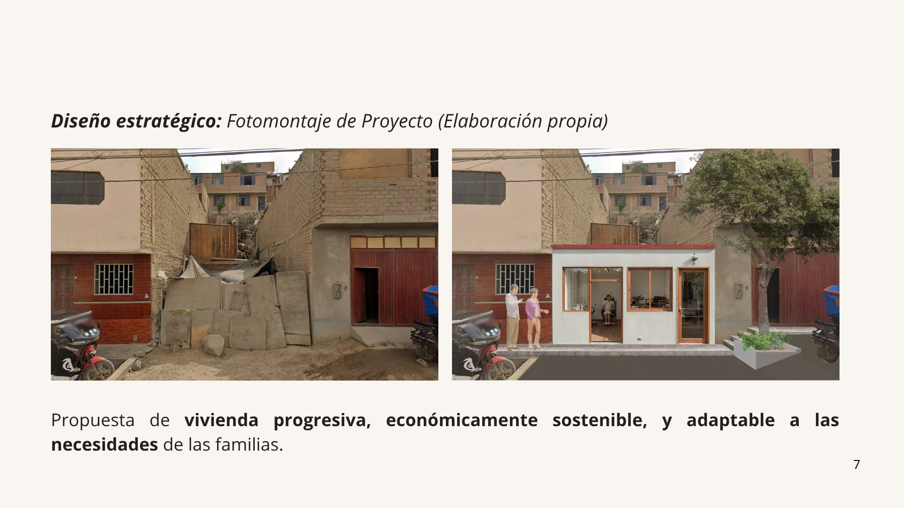
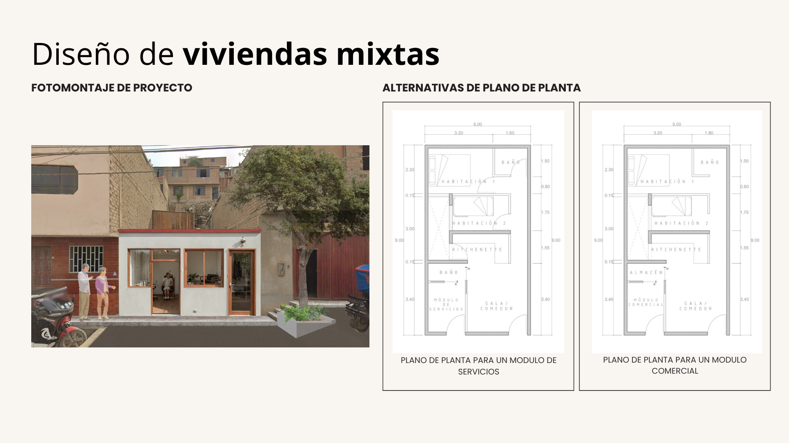
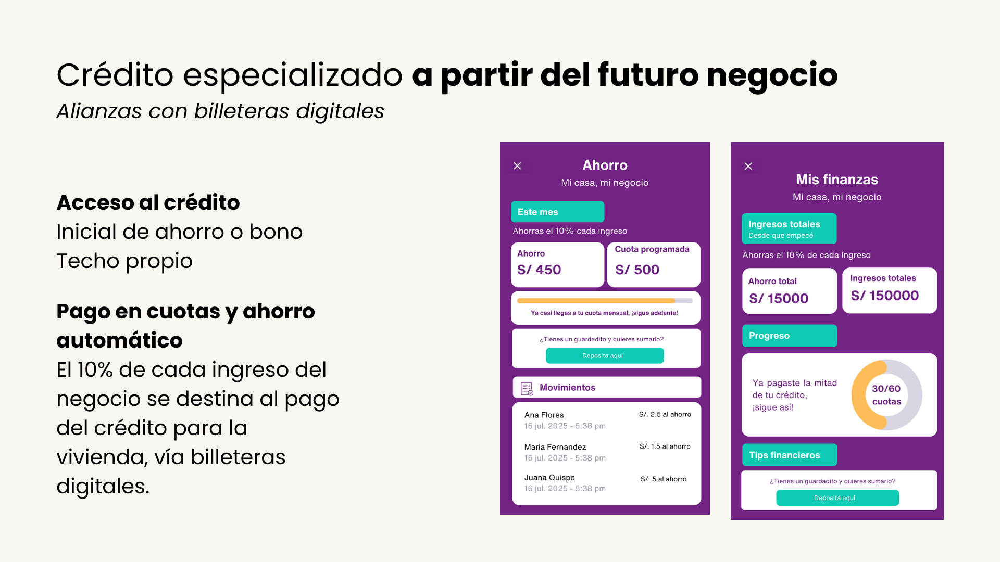

# Portafolio 
Hola, soy Lucía. Me formé como socióloga en la PUCP y me gusta observar cómo las personas viven, deciden y habitan lo cotidiano. He trabajado en investigación cualitativa aplicada y he comenzado a explorar caminos en diseño de servicios e innovación, siempre desde una mirada crítica y situada. Creo en la escucha activa, en las preguntas bien hechas y en traducir hallazgos en ideas accionables. Este enfoque me llevó a proponer soluciones que combinan análisis urbano, vivienda, migración y género con metodologías participativas. Una de ellas fue “Mi casa, mi negocio”, propuesta ganadora del reto Mezcladora Home Challenge, 2025. También desarrollé un policy brief con recomendaciones para el programa Techo Propio, el cual presenté en el Instituto Metropolitano de Planificación. Más abajo puedes ver algunos de los proyectos que marcan el rumbo que estoy construyendo. Estoy en formación, y con muchas ganas de seguir aprendiendo.  
- 📩 [lucia.villegas@pucp.edu.pe](mailto:lucia.villegas@pucp.edu.pe)  
- 🔗 [LinkedIn](http://www.linkedin.com/in/luciavillegasguerrero)

## 🏠 Mi casa, mi negocio
**Reto:** Mezcladora Home Challenge – UTEC Ventures  
**Rol:** Coautora de la propuesta interdisciplinaria  
**Año:** 2025  

### Resumen del proyecto
 “Mi casa, mi negocio” fue una propuesta ganadora del reto Mezcladora Home Challenge, centrado en imaginar soluciones habitacionales innovadoras para familias de sectores C y D. Diseñamos una solución de vivienda mixta que permite a las familias generar ingresos desde el hogar y acceder al sistema financiero de forma progresiva.
Combinamos diseño arquitectónico funcional, estrategias de inclusión financiera y un enfoque participativo centrado en las necesidades reales de las familias. El reto fue una oportunidad para integrar metodologías de diseño de servicios con herramientas de análisis urbano y sensibilidad social.

### Lo que hice
- Co-diseñé la propuesta conceptual, enfocada en las necesidades de familias con ingresos informales.
- Aporté al análisis de usuario, construcción del caso ejemplo y estructuración narrativa del entregable.
- Participé en la elaboración de un pitch claro, visual y orientado a viabilidad técnica y social.

### Lo que aprendí
- Fue mi primer acercamiento a metodologías de innovación aplicada y diseño de servicios. Descubrí el valor de trabajar desde el problema, escuchar sin suposiciones y prototipar pensando en lo posible, no solo en lo ideal.

## 🧱 Vivienda digna en Lima Metropolitana
**Evento:** I Diálogo Urbano Metropolitano – Instituto Metropolitano de Planificación  
**Rol:** Autora y expositora del policy brief  
**Año:** 2025  
### Resumen del proyecto
Esta propuesta parte de un insight claro: las mujeres jefas de hogar son clave para activar procesos de mejora habitacional, pero los programas actuales no están diseñados para responder a su realidad. A partir de esa premisa, desarrollé un policy brief con foco en usuarios reales, brechas estructurales y rediseño de procesos.
La propuesta integra tres frentes: acceso al financiamiento, asistencia técnica accesible y asignación equitativa de recursos. Todo bajo una lógica de progresividad, flexibilidad y escalabilidad urbana. El enfoque fue generar una estrategia viable y centrada en el usuario, que articule diseño, datos y política pública.
### Lo que hice
- Sistematización de datos secundarios y benchmarking de políticas habitacionales con enfoque comparativo.
- Identificación de puntos críticos del programa Techo Propio desde la experiencia usuaria.
- Rediseño de componentes clave del programa, priorizando la autonomía económica de mujeres, el acompañamiento técnico y el acceso a soluciones progresivas y adaptadas.
- Diseño visual y narrativo del brief para toma de decisiones estratégicas, y presentación del pitch en evento público.

